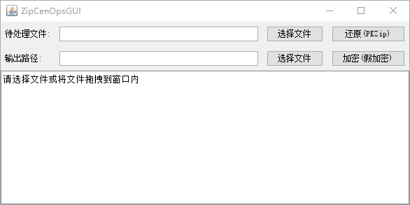

# ZipCenOpGUI



ZipCenOpGUI is a mod of ZipCenOp, which is a Java tool to play with Zip pseudo-encryption.

## Usage
### ZipCenOpGUI.jar
```shell
java -jar ZipCenOpGUI.jar
```
or double click `ZipCenOpGUI.jar` to run.

### ZipCenOp.jar
```shell
java -jar ZipCenOp.jar <option> <file>
option:
r : recover a PKZip
e : do a fake encryption
```

## Contributing
Pull requests are welcome. For major changes, please open an issue first to discuss what you would like to change.

Please make sure to update tests as appropriate.

## License
[MIT](https://choosealicense.com/licenses/mit/)